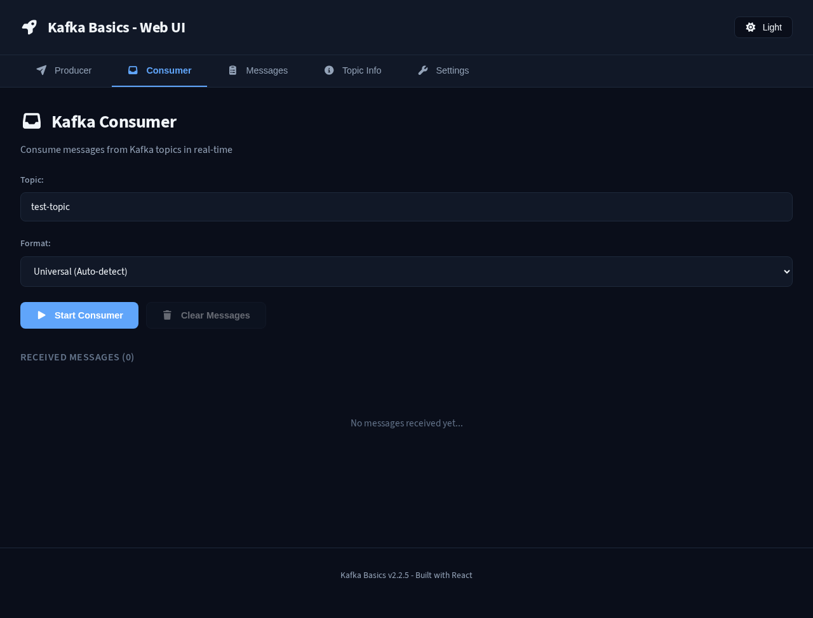
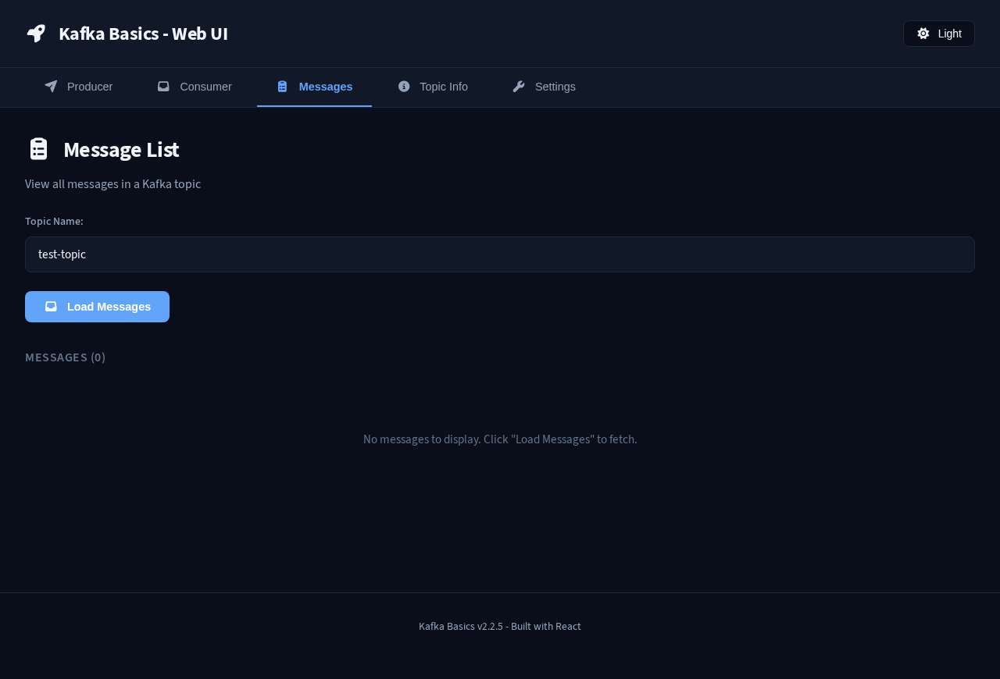
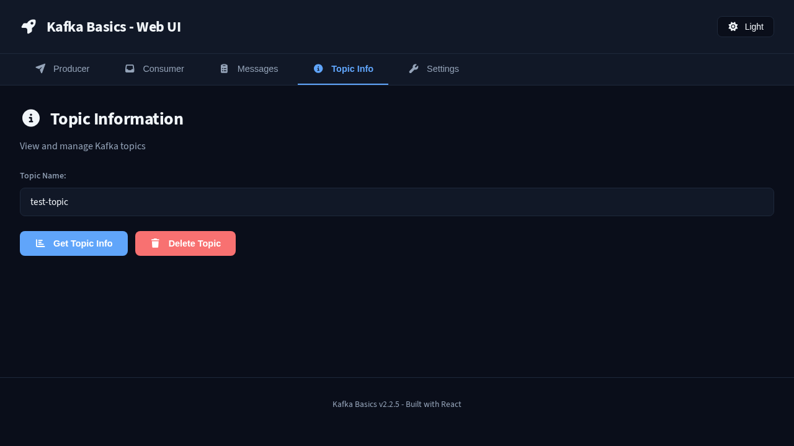
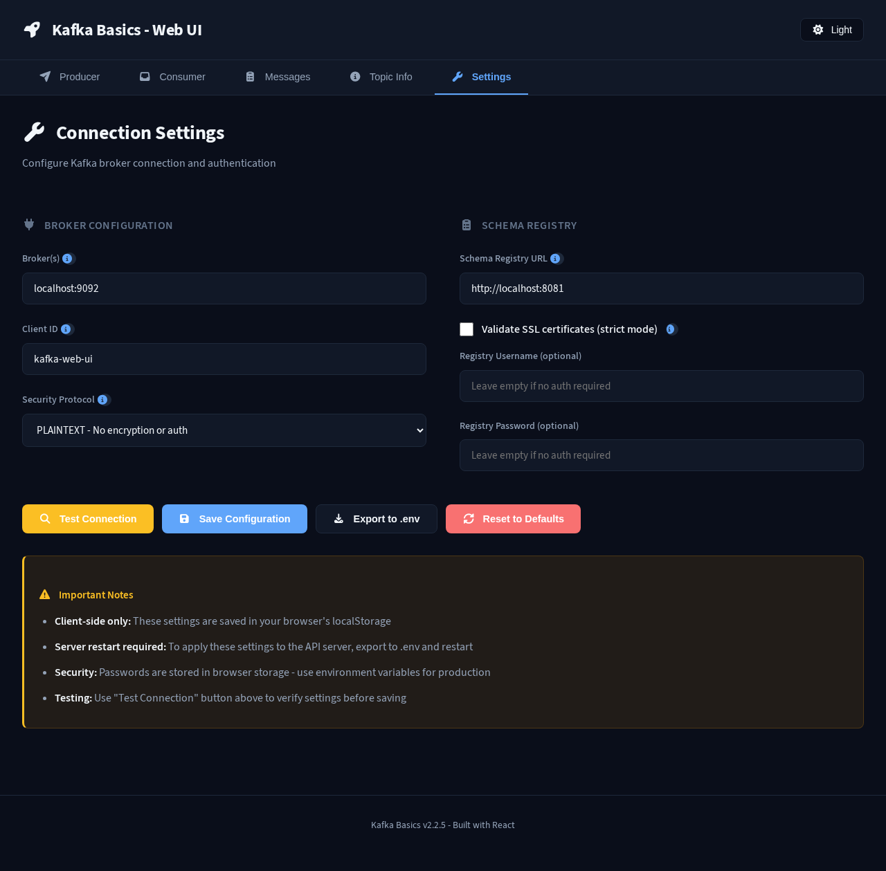
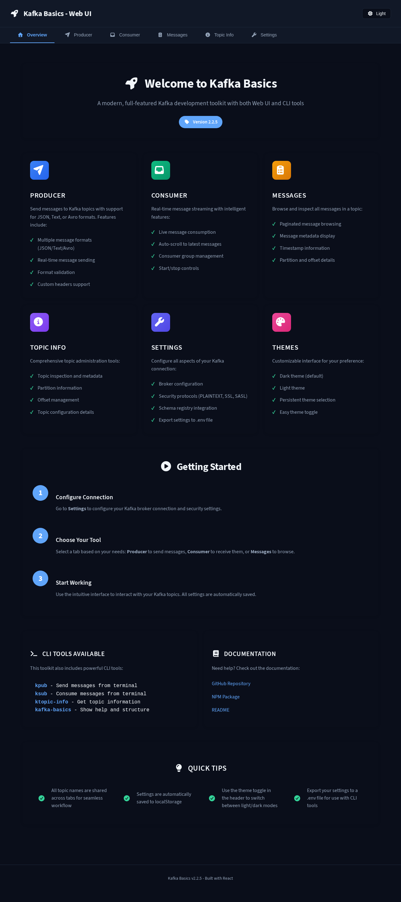
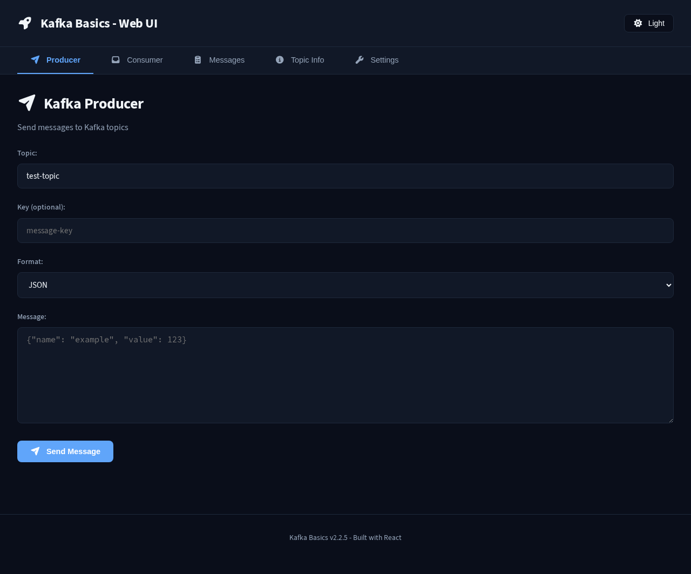
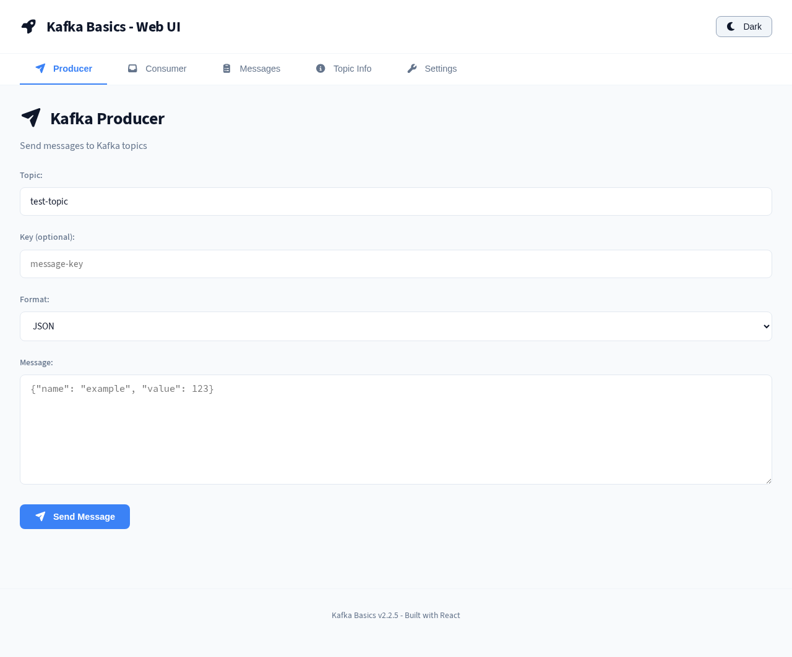

# Kafka Basics

> Complete Kafka toolkit with web UI, CLI tools, and comprehensive documentation

[](https://www.npmjs.com/package/@oriolrius/kafka-basics)
[](LICENSE)
[](https://www.npmjs.com/package/@oriolrius/kafka-basics)

A modern, full-featured Kafka development toolkit with both **React Web UI** and **CLI tools** for producers, consumers, and topic administration.

## ✨ Features

- 🌐 **Modern Web UI** - React-based interface with light/dark themes
- 📤 **Producers** - Send JSON, Text, or Avro messages
- 📥 **Consumers** - Real-time message streaming with auto-scroll
- ⚙️ **Admin Tools** - Topic management and inspection
- 🔧 **Connection Settings** - Configure all Kafka security protocols
- 🧪 **Testing** - Playwright E2E test suite
- 🐳 **Docker Support** - Kafka broker setup included

## 🚀 Quick Start

Try the toolkit instantly without installation using `npx`:

```bash
# Show help and available commands
npx @oriolrius/kafka-basics

# Get topic information
npx @oriolrius/kafka-basics ktopic-info

# Send a message to a topic
npx @oriolrius/kafka-basics kpub

# Consume messages from a topic
npx @oriolrius/kafka-basics ksub
```

> **Note:** You can run any CLI command directly with `npx @oriolrius/kafka-basics <command>`

**⚙️ Configuration:** By default, commands connect to `localhost:9092`. For custom Kafka brokers or security settings, see the [Configuration](#%EF%B8%8F-configuration) section to set up environment variables or use inline parameters.

## 📦 Installation

For regular use, install the package globally or locally:

### Global Installation (Recommended for CLI)

```bash
npm install -g @oriolrius/kafka-basics
# or
pnpm add -g @oriolrius/kafka-basics
# or
yarn global add @oriolrius/kafka-basics
```

After global installation, use commands directly:

```bash
kafka-basics          # Show help
kpub                  # Send messages
ksub                  # Consume messages
ktopic-info           # Topic information
kstart                # Show structure
```

### Local Installation (For Development)

```bash
# Clone the repository
git clone https://github.com/oriolrius/kafka-basics.git
cd kafka-basics

# Install dependencies
pnpm install

# Use with pnpm scripts
pnpm kstart           # Show help
pnpm kpub             # Send message
pnpm ksub             # Consume messages
```

## 📖 Documentation

| Document | Description |
|----------|-------------|
| [TESTING.md](TESTING.md) | Playwright testing guide |
| [README.md](README.md) | This file - overview and CLI reference |

## 🔧 CLI Usage

The toolkit provides comprehensive command-line tools for all Kafka operations.

### Producers

Send messages to Kafka topics:

```bash
# JSON/Text producer (interactive or with environment variables)
kpub
# or with npx
npx @oriolrius/kafka-basics kpub

# Avro producer with schema registry support
kpub-avro
# or
pnpm kpub-avro
```

**Environment variables:**

```bash
KAFKA_TOPIC=my-topic KAFKA_MESSAGE_CONTENT='{"key":"value"}' kpub
```

### Consumers

Consume messages from Kafka topics:

```bash
# JSON/Text consumer
ksub
# or with npx
npx @oriolrius/kafka-basics ksub

# Avro consumer with schema registry support
ksub-avro
# or
pnpm ksub-avro

# Universal consumer (auto-detect format)
ksub-universal
# or
pnpm ksub-universal
```

### Admin Tools

Manage and inspect Kafka topics:

```bash
# Show topic information (partitions, offsets, etc.)
ktopic-info
# or with npx
npx @oriolrius/kafka-basics ktopic-info

# List all messages in a topic
pnpm klist

# Delete a topic
pnpm ktopic-delete
```

### Utilities

```bash
# Show help and project structure
kstart
# or with npx
npx @oriolrius/kafka-basics

# Test Kafka connection and diagnostics
pnpm kdiagnose
```

### CLI Examples

```bash
# View topic information
KAFKA_TOPIC=my-topic ktopic-info

# Send a message
KAFKA_TOPIC=my-topic KAFKA_MESSAGE_CONTENT="Hello Kafka!" kpub

# Consume messages
KAFKA_TOPIC=my-topic ksub

# List all messages in a topic
KAFKA_TOPIC=my-topic pnpm klist
```

## 🌐 Web Interface

Modern React-based UI for visual Kafka management. Perfect for development and testing.

### Starting the Web Interface

```bash
# Start local Kafka broker for testing (optional - see Testing & Development section)
docker compose up -d

# Launch Web UI + API server
pnpm web
```

Access the interface at: **<http://localhost:3000>**

> **Note:** The `docker compose` command starts a local Kafka broker for testing purposes only. If you already have a Kafka broker running (locally or remotely), skip this step and configure the connection in the Settings tab.

### Web UI Features

The web interface includes six main tabs:

- **🏠 Overview** - Welcome page with feature explanations and quick start guide
- **📤 Producer** - Send messages to topics with JSON, Text, or Avro format
- **📥 Consumer** - Real-time message streaming with auto-scroll
- **📋 Messages** - Browse all messages in a topic with pagination
- **⚙️ Admin** - Topic information, management, and inspection
- **🔧 Settings** - Configure Kafka connections, security, and schema registry

#### Screenshots

Click on any screenshot to view full size:

<table>
  <tr>
    <td width="33%" align="center">
      <strong>📤 Producer Tab</strong><br/>
      <a href="assets/producer-tab.png">
        
      </a>
    </td>
    <td width="33%" align="center">
      <strong>📥 Consumer Tab</strong><br/>
      <a href="assets/consumer-tab.png">
        
      </a>
    </td>
    <td width="33%" align="center">
      <strong>📋 Messages Tab</strong><br/>
      <a href="assets/messages-tab.png">
        
      </a>
    </td>
  </tr>
  <tr>
    <td width="33%" align="center">
      <strong>⚙️ Admin Tab</strong><br/>
      <a href="assets/admin-tab.png">
        
      </a>
    </td>
    <td width="33%" align="center">
      <strong>🔧 Settings Tab</strong><br/>
      <a href="assets/settings-tab.png">
        
      </a>
    </td>
    <td width="33%" align="center">
      <strong>📱 Overview</strong><br/>
      <a href="assets/overview.png">
        
      </a>
    </td>
  </tr>
</table>

**Theme Support**

The application supports both light and dark themes. Click to view full size:

<table>
  <tr>
    <td width="50%" align="center">
      <strong>🌙 Dark Theme</strong><br/>
      <a href="assets/dark-theme.png">
        
      </a>
    </td>
    <td width="50%" align="center">
      <strong>☀️ Light Theme</strong><br/>
      <a href="assets/light-theme.png">
        
      </a>
    </td>
  </tr>
</table>

### Web UI Controls

- **Light/Dark Theme** - Toggle between themes with one click
- **Export Settings** - Save configuration to `.env` file
- **Real-time Updates** - Live message streaming in consumer
- **Auto-scroll** - Automatically scroll to latest messages

### Web UI Scripts

```bash
pnpm web               # Start both API and frontend
pnpm api               # Start API server only (port 3001)
pnpm dev               # Start frontend only (port 3000)
pnpm build             # Build for production
pnpm preview           # Preview production build
```

## 📁 Project Structure

```text
kafka-basics/
├── src/
│   ├── web/              # React Web UI
│   │   ├── components/   # React components
│   │   ├── App.jsx       # Main app
│   │   ├── main.jsx      # Entry point
│   │   └── styles.css    # Styling
│   ├── api/              # Express API server
│   │   └── server.js     # Backend for web UI
│   ├── producers/        # CLI producers
│   │   ├── producer.js
│   │   └── avro-producer.js
│   ├── consumers/        # CLI consumers
│   │   ├── consumer.js
│   │   ├── avro-consumer.js
│   │   └── universal-consumer.js
│   ├── admin/            # CLI admin tools
│   │   ├── topic-info.js
│   │   ├── delete-topic.js
│   │   └── list-messages.js
│   └── utils/            # Shared utilities
│       ├── kafka-config.js
│       └── diagnostic.js
├── bin/                  # CLI executables
├── tests/                # Playwright E2E tests
├── schemas/              # Avro schemas
├── examples/             # Example messages
├── docker-compose.yml    # Kafka broker setup
├── index.html            # Web UI entry
├── vite.config.js        # Vite configuration
└── package.json          # Dependencies and scripts
```

## ⚙️ Configuration

### Environment Variables

Configuration can be set via environment variables or a `.env` file in your working directory. This works with `npx`, global installation, or local development.

**How to use:**

```bash
# Option 1: Inline environment variables (works with npx)
KAFKA_BROKERS=my-broker:9092 KAFKA_TOPIC=my-topic npx @oriolrius/kafka-basics ksub

# Option 2: Create .env file in current directory
echo "KAFKA_BROKERS=my-broker:9092" > .env
npx @oriolrius/kafka-basics ksub

# Option 3: Export in shell session
export KAFKA_BROKERS=my-broker:9092
npx @oriolrius/kafka-basics ksub
```

**Available variables:**

```env
# Kafka Broker Configuration
KAFKA_BROKERS=localhost:9092          # Comma-separated broker list
KAFKA_CLIENT_ID=kafka-web-ui          # Client identifier
KAFKA_TOPIC=my-topic                  # Default topic name

# Security Protocol
# Options: PLAINTEXT, SSL, SASL_PLAINTEXT, SASL_SSL
SECURITY_PROTOCOL=PLAINTEXT

# SSL/TLS Configuration (for SSL or SASL_SSL protocols)
KAFKA_USE_TLS=false                   # Enable TLS encryption
KAFKA_REJECT_UNAUTHORIZED=true        # Verify SSL certificates
KAFKA_CA_CERT=/path/to/ca.pem        # CA certificate path (optional)
KAFKA_CLIENT_CERT=/path/to/cert.pem  # Client certificate path (optional)
KAFKA_CLIENT_KEY=/path/to/key.pem    # Client key path (optional)

# SASL Authentication (for SASL_PLAINTEXT or SASL_SSL protocols)
# Mechanisms: plain, scram-sha-256, scram-sha-512, aws, oauthbearer
KAFKA_SASL_MECHANISM=plain
KAFKA_USERNAME=your-username          # SASL username
KAFKA_PASSWORD=your-password          # SASL password

# Schema Registry (for Avro messages)
SCHEMA_REGISTRY_URL=http://localhost:8081
SCHEMA_REGISTRY_USE_TLS=false
SCHEMA_REGISTRY_USERNAME=             # Basic auth username (optional)
SCHEMA_REGISTRY_PASSWORD=             # Basic auth password (optional)

# API Server (for Web UI)
API_PORT=3001                         # Backend API port

# Message Configuration
KAFKA_MESSAGE_CONTENT={"key":"value"} # Default message for producer
KAFKA_MESSAGE_KEY=my-key              # Message key (optional)
```

### Configuration Priority

Settings are applied in this order (later overrides earlier):

1. Default values (localhost:9092, PLAINTEXT)
2. `.env` file in current directory
3. Environment variables in shell
4. Inline environment variables with command
5. Web UI settings (saved to browser localStorage)

### Example Configurations

**Local development (default):**

```bash
KAFKA_BROKERS=localhost:9092
SECURITY_PROTOCOL=PLAINTEXT
```

**Production with SASL/SSL:**

```bash
KAFKA_BROKERS=broker1.prod:9093,broker2.prod:9093
SECURITY_PROTOCOL=SASL_SSL
KAFKA_SASL_MECHANISM=scram-sha-256
KAFKA_USERNAME=my-user
KAFKA_PASSWORD=secret-password
KAFKA_USE_TLS=true
```

**With Schema Registry:**

```bash
KAFKA_BROKERS=localhost:9092
SCHEMA_REGISTRY_URL=http://localhost:8081
SCHEMA_REGISTRY_USERNAME=registry-user
SCHEMA_REGISTRY_PASSWORD=registry-pass
```

### Web UI Settings

Alternatively, configure connection settings directly in the **🔧 Settings** tab:

- Broker addresses and client ID
- Security protocols (PLAINTEXT, SSL, SASL_PLAINTEXT, SASL_SSL)
- Authentication mechanisms (PLAIN, SCRAM-SHA-256, SCRAM-SHA-512, AWS, OAuth)
- SSL/TLS certificates and verification
- Schema Registry URL and credentials
- Export current settings to `.env` file

## 🧪 Testing & Development

### Local Kafka Broker (Docker)

For testing and development, you can run a local Kafka broker using Docker Compose. **This is only needed if you don't have a Kafka broker available** - it's not required to run kafka-basics itself.

```bash
# Start local Kafka broker
docker compose up -d

# Stop Kafka broker
docker compose down
```

**What this provides:**

- Kafka broker on `localhost:9092`
- Single-node KRaft mode (no Zookeeper required)
- Auto-created topics enabled
- Persistent volume for data

### Running Tests

Comprehensive Playwright test suite covering all features:

```bash
# Start local Kafka broker (if needed)
docker compose up -d

# Start web server (in one terminal)
pnpm web

# Run tests (in another terminal)
pnpm test:headless     # Run all tests (CI mode)
pnpm test:headed       # Run with browser visible
pnpm test:ui           # Interactive test UI
pnpm test:debug        # Debug tests step-by-step
pnpm test:report       # View last test report
```

📚 **[Complete Testing Guide →](tests/README.md)**

## 🏗️ Technology Stack

**Frontend:**

- React 19.2.0
- Vite 7.1.9
- Modern ES modules

**Backend:**

- Express 5.1.0
- KafkaJS 2.2.4
- CORS enabled

**Testing:**

- Playwright
- Chromium headless

**Infrastructure:**

- Docker Compose
- Apache Kafka (latest)
- Node.js 18+

## 📖 Usage Examples

### Quick Start with npx (No Installation)

```bash
# Show available commands
npx @oriolrius/kafka-basics

# Get topic information
KAFKA_TOPIC=my-topic npx @oriolrius/kafka-basics ktopic-info

# Send a test message
KAFKA_TOPIC=my-topic KAFKA_MESSAGE_CONTENT='{"test":"hello"}' npx @oriolrius/kafka-basics kpub

# Consume messages
KAFKA_TOPIC=my-topic npx @oriolrius/kafka-basics ksub
```

### Web UI Workflow

1. (Optional) Start local Kafka broker for testing: `docker compose up -d`
2. Launch UI: `pnpm web`
3. Open browser: <http://localhost:3000>
4. Go to **Settings** → Configure connection (use `localhost:9092` if using Docker)
5. Go to **Producer** → Send test message
6. Go to **Consumer** → Start consumer and see messages
7. Go to **Admin** → View topic info

### CLI Workflow (After Installation)

```bash
# View topic information
KAFKA_TOPIC=my-topic ktopic-info

# Send a JSON message
KAFKA_TOPIC=my-topic KAFKA_MESSAGE_CONTENT='{"user":"john","action":"login"}' kpub

# Consume messages in real-time
KAFKA_TOPIC=my-topic ksub

# List all messages in a topic
KAFKA_TOPIC=my-topic pnpm klist
```

## 🤝 Contributing

Contributions welcome! Please:

1. Fork the repository
2. Create a feature branch
3. Make your changes
4. Test thoroughly
5. Submit a pull request

## 📄 License

MIT License - see LICENSE file for details

## 🙏 Acknowledgments

- Built with [KafkaJS](https://kafka.js.org/)
- UI powered by [React](https://react.dev/)
- Testing with [Playwright](https://playwright.dev/)

---

**Author:** Oriol Rius  
**Repository:** <https://github.com/oriolrius/kafka-basics>  
